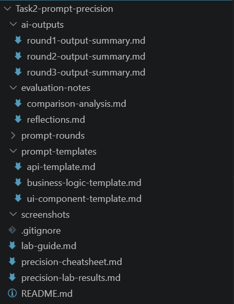
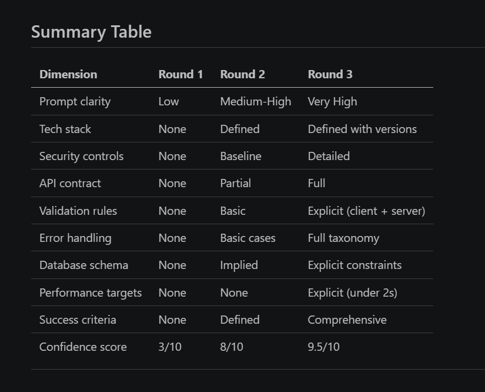

# Module 1 Task 2: Prompt Precision Lab

## EPAM A!Tech Bootcamp

---

## Project Title

**Prompt Precision Lab: From Vague Prompting to Production-Ready Specifications**

## Objective of the Lab

The objective of this lab is to practice precision prompting by iteratively improving prompt quality across three rounds. The same authentication-system task is rewritten from vague to highly detailed to show how prompt clarity directly impacts implementation quality, security coverage, and confidence.

Core feature used in all rounds:

* User registration
* User login
* Password management

---

## Folder Structure

```text
Task2-prompt-precision/
├── README.md
├── lab-guide.md
├── precision-cheatsheet.md
├── prompt-rounds/
│   ├── round1-vague-prompt.md
│   ├── round2-improved-prompt.md
│   └── round3-precise-prompt.md
├── prompt-templates/
│   ├── api-template.md
│   ├── business-logic-template.md
│   └── ui-component-template.md
├── evaluation-notes/
│   ├── comparison-analysis.md
│   └── reflections.md
├── demo-auth-app/
│   ├── round1-basic/
│   │   ├── app.py
│   │   ├── models.py
│   │   └── templates/
│   ├── round2-improved/
│   │   ├── app.py
│   │   ├── models.py
│   │   └── templates/
│   └── round3-precise/
│       ├── app.py
│       ├── models.py
│       └── templates/
└── screenshots/
```

---

## Progressive Demo Authentication App

To support the Prompt Precision Lab, the Flask demo authentication app is organized into three progressively improved rounds:

* **Round 1 — Basic**: minimal prototype-style UI and basic login/register flow.
* **Round 2 — Improved**: cleaner form structure, better spacing, and stronger validation behavior.
* **Round 3 — Precise**: polished responsive layout, clearer UX messaging, and production-oriented presentation.

Each round runs independently:

* `round1-basic/app.py` -> port **5000**
* `round2-improved/app.py` -> port **5001**
* `round3-precise/app.py` -> port **5002**

---

## Round-by-Round Description

### Round 1: Vague Prompt

Round 1 intentionally uses a minimal prompt with limited context.

* Result: High ambiguity and many AI assumptions
* Typical gaps: stack choice, security controls, API contract, schema, validation
* Confidence: Low (good for brainstorming only)

### Round 2: Improved Prompt

Round 2 introduces clear scope and technical direction.

* Result: Better structure and reduced assumptions
* Improvements: explicit stack, baseline security, clearer feature expectations
* Confidence: Medium-High (implementation planning possible)

### Round 3: Precise Prompt (Production-Ready)

Round 3 defines detailed implementation and non-functional requirements.

* Result: Near production-ready output expectations
* Improvements: full API contracts, validation rules, security requirements, schema details, performance targets, measurable success criteria
* Confidence: Very High (strong execution and handoff quality)

---

## Prompt Precision Techniques Used

The lab applied these precision techniques to improve outcomes:

* **Be clear and direct**: use explicit instructions and avoid open interpretation.
* **Specify the tech stack**: define frontend, backend, runtime, and database choices.
* **Provide implementation context**: clarify architecture, responsibilities, and expected behavior.
* **Define constraints**: include security requirements, validation rules, and performance limits.
* **Standardize outputs**: enforce request/response and error format consistency.
* **Set success criteria**: convert intent into testable, measurable acceptance conditions.

---

## Key Learnings

* Prompt quality strongly influences engineering quality.
* Vague prompts increase rework and risk.
* Security details must be explicit, not implied.
* API and response contracts reduce integration friction.
* Precision increases initial prompt effort but decreases total delivery effort.
* High-precision prompts act as lightweight technical specifications.

---

## Screenshots

### Project Structure

> Repository layout and file organization of the Prompt Precision Lab.



---

### Prompt Comparison Snapshot

> Visual comparison of outcomes across prompt precision rounds.



---

## Live Demo Links

Access the deployed authentication demos for each prompt-precision round:

* [Round 1 Demo](https://round1-auth-demo.vercel.app/login)
* [Round 2 Demo](https://round2-auth-demo.vercel.app/login)
* [Round 3 Demo](https://round3-auth-demo.vercel.app/login)

---

## Technologies and AI Tools Used

### Technologies

* Markdown for documentation
* GitHub-compatible project structure

### AI Tools

* GitHub Copilot Chat (GPT-5.3-Codex)
* Prompt iteration and evaluation workflow from EPAM A!Tech lab guidance

---

## Conclusion

This lab demonstrates that prompt precision is a practical engineering skill. Moving from vague requests to highly structured prompts significantly improves reliability, security, and implementation readiness. In the context of EPAM A!Tech Bootcamp Module 1, prompt precision is a core accelerator for quality and delivery speed.
